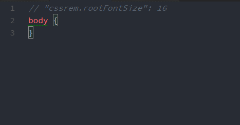

# cssrem

A `px` to `rem` plugin in VSCode

[中文版](README.zh-CN.md)



# Install

```bash
ext install cssrem
```

# How To Use

+ Auto snippet
+ CLI: Press `F1`, enter `cssrem`

# Support Language

html vue css less scss sass stylus tpl（php smarty3）

# Configuration

Open your user and workspace settings (`File > Preferences > Settings`):

+ `cssrem.rootFontSize` root font-size (unit: px), default: 16
+ `cssrem.fixedDigits` `px` to `rem` decimal point maximum length, default: 6
+ `cssrem.autoRemovePrefixZero` Automatically remove prefix 0, default: true

**NOTE:** Muse be restart vscode after modification
