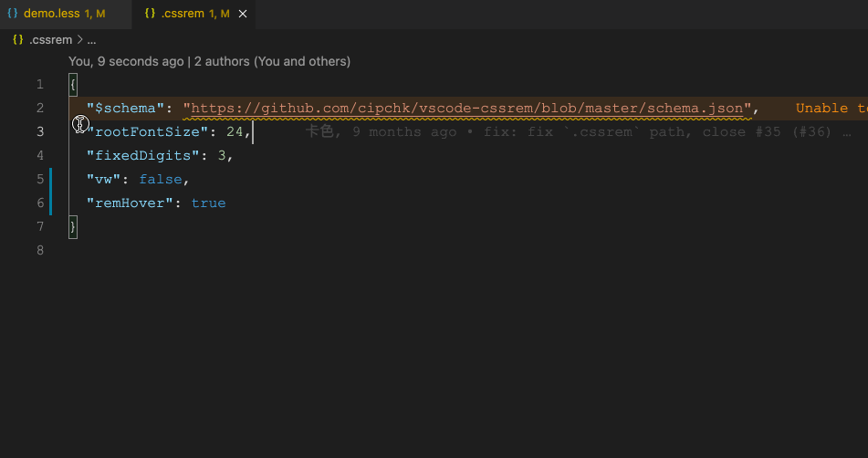

# cssrem

Converts between `px` and `rem` units in VSCode, And support WXSS.

[中文版](README.zh-CN.md)



# Features

- Support intellisense
  - `px` -> `rem` (Shortcut key: `Alt + z`)
  - `rem` -> `px` (Shortcut key: `Alt + z`)
  - `px` -> `vw` (Shortcut key: `Alt + v, Alt + w`)
  - `vw` -> `px` (Shortcut key: `Alt + v, Alt + w`)
  - `px` -> `rpx` (微信小程序, 快捷键：`Alt + r`)
  - `rpx` -> `px` (微信小程序, 快捷键：`Alt + r`)
- Support mouse hover to display the conversion process
- Support mark
- Support selected area

> You can use VSCODE's Keyboard shortcuts to redefine the shortcut keys.

# How To Use

+ Auto snippet
+ Move the cursor to `14px`, press `Alt + z` to convert `rem`
+ CLI: Press `F1`, enter `cssrem`

# Support Language

html vue css less scss sass stylus tpl(php smarty3) tsx jsx

# Configuration

The `.cssrem` file in the root directory has the highest priority, and it's format is as follows:

```json
{
  "$schema": "https://raw.githubusercontent.com/cipchk/vscode-cssrem/master/schema.json",
  "rootFontSize": 18,
  "fixedDigits": 3
}
```

Secondly, you can also configure the global. Open your user and workspace settings (`File > Preferences > Settings`):

| Name | Description | Default |
|------|-------------|---------|
| `cssrem.rootFontSize` | Root font-size (Unit: `px`) | `16` |
| `cssrem.fixedDigits` | Keeping decimal point maximum length | `4` |
| `cssrem.autoRemovePrefixZero` | Automatically remove prefix 0 | `true` |
| `cssrem.ingoresViaCommand` | Ignores `px` to `rem` when trigger command (Unit: `string[]`), can be set `[ "1px", "0.5px" ]` | `[]` |
| `cssrem.addMark` | Whether to enabled mark | `false` |
| `cssrem.hover` | Whether to enable display conversion data on hover, `disabled`: Disabled, `always` Anything, `onlyMark`: Only valid when `cssrem.addMark` is `true` | `onlyMark` |
| `cssrem.currentLine` | Whether to display mark in after line, `disabled`: Disabled, `show` Show | `show` |
| `cssrem.ignores` | Ignore file list, support glob, like this: `[ 'demo.less', '**/*.styles' ]` | `string[]` |
| `cssrem.languages` | Support language list `[ 'html', 'vue', 'css', 'postcss', 'less', 'scss', 'sass', 'stylus', 'tpl', 'wxss', 'twig', 'javascriptreact', 'typescriptreact', 'javascript', 'typescript' ]`, By default all include | `string[]` |
| `cssrem.remHover` | Whether to enable rem hover | `true` |
| `cssrem.vw` | Whether to enable VW switch px support | `false` |
| `cssrem.vwHover` | Whether to enable vw hover | `true` |
| `cssrem.vwDesign` | Specifies the width of the design (equar to the browser viewport width) | `750` |
| `cssrem.wxss` | **WXSS小程序样式** Whether to enable WXSS support | `false` |
| `cssrem.wxssScreenWidth` | **WXSS小程序样式** 规定屏幕宽度，默认 `750`，[尺寸单位](https://developers.weixin.qq.com/miniprogram/dev/framework/view/wxss.html) | `750` |
| `cssrem.wxssDeviceWidth` | **WXSS小程序样式** 设备分辨率宽度，官方推荐使用 iPhone6 作为视觉稿的标准 | `375` |

# QA

**JSX not working?**

By default, vscode won’t auto-complete strings in JSX. You can configure this in your project’s `.vscode/settings.json`:

```json
{
  "editor.quickSuggestions": {
		"other": true,
		"comments": false,
		"strings": true
	}
}
```
