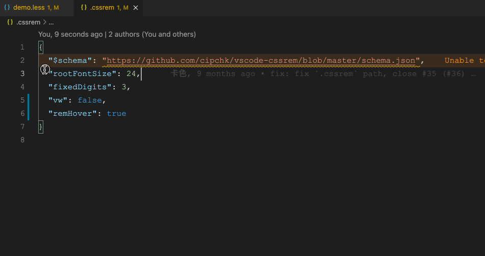

# cssrem

一个 `px` 与 `rem` 单位互转的 VSCode 插件，且支持WXSS微信小程序。



# 特性

- 支持智能感知
  - `px` -> `rem`
  - `rem` -> `px`
  - `px` -> `rpx` (微信小程序)
  - `rpx` -> `px` (微信小程序)
- 支持鼠标悬停显示转化过程
- 支持直接打上标记

# 如何使用

+ 在文件内自动转换，例如录入 `12px` 智能提醒对应转化后 `rem` 值
+ 通过 `F1` 面板查找：`cssrem`

# 支持语言

html vue css less scss sass stylus tpl(php smarty3) tsx jsx

# 配置

根目录的 `.cssrem` 文件优先级最高，其格式如下：

```json
{
  "rootFontSize": 18,
  "fixedDigits": 3
}
```

其次，也可以配置全局，点击 VS Code 的 `文件 > 首选项 > 设置`，打开设置面板：

| 名称 | 描述 | 默认值 |
|----|----|-----|
| `cssrem.rootFontSize` | 基准font-size（单位：`px`） | `16` |
| `cssrem.fixedDigits` | 保留小数点最大长度 | `6` |
| `cssrem.autoRemovePrefixZero` | 自动移除0开头的前缀 | `true` |
| `cssrem.ingoresViaCommand` | 当使用命令行批量转换时，允许忽略部分 `px` 值不转换成 `rem`（单位：`string[]`），例如：`[ "1px", "0.5px" ]` | `[]` |
| `cssrem.addMark` | 是否启用加上标记 | `false` |
| `cssrem.hover` | 是否启用悬停时显示转换数据, `disabled`: Disabled, `always` Anything, `onlyMark`: Only valid when `cssrem.addMark` is `true` | `onlyMark` |
| `cssrem.ingores` | 忽略文件清单，例如：`[ 'demo.less', 'src' ]` | `string[]` |
| `cssrem.languages` | 支持语言清单，默认：`[ 'html', 'vue', 'css', 'postcss', 'less', 'scss', 'sass', 'stylus', 'javascriptreact', 'typescriptreact' ]` | `string[]` |
| `cssrem.wxss` | **WXSS小程序样式** 是否启用WXSS支持 | `false` |
| `cssrem.wxssScreenWidth` | **WXSS小程序样式** 规定屏幕宽度，默认 `750`，[尺寸单位](https://developers.weixin.qq.com/miniprogram/dev/framework/view/wxss.html) | `750` |
| `cssrem.wxssDeviceWidth` | **WXSS小程序样式** 设备分辨率宽度，官方推荐使用 iPhone6 作为视觉稿的标准 | `375` |
